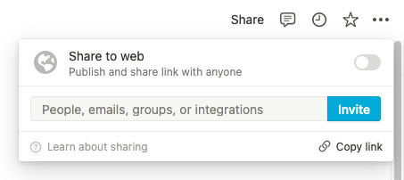
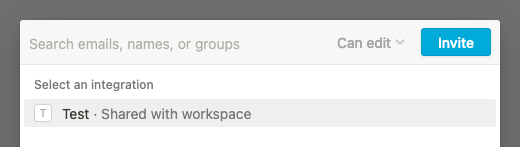

# 🐈 GitHub to Notion

> Migrate GitHub project data to a Notion database.

## Overview

Take all the cards from a GitHub project, whether they're notes or
issues, and import their content in a Notion database.

You can configure what Notion property the GitHub column name will go
in, as well as a Notion select or multiselect to put the GitHub issue
labels.

## Requirements

[Node.js](https://nodejs.org/) version 18 or later.

## Installation

```sh
git clone https://github.com/valeriangalliat/github-to-notion
cd github-to-notion
npm install
```

## Process

### 1. Create a GitHub token

Go to your [GitHub developer settings](https://github.com/settings/tokens)
to create a personal access token.

### 2. Dump the project as JSON

Use the `dump-github-project.js` script to dump the project of your
choice as JSON. It will fetch all the columns and all the cards in each
column, and the associated issues.

```sh
GITHUB_TOKEN=your-github-token node dump-github-project.js <project-url> > project.json
```

The project URL typically looks like:

```
https://github.com/owner/repo/projects/42
```

This file will be used in the next step to import into Notion.

### 3. Create a Notion integration

Notion doesn't have a concept of personal access tokens so we need to
create an integration for this to work. We'll follow the steps from
their [API getting started documentation](https://developers.notion.com/docs/getting-started).

Go to the [my integrations](https://www.notion.so/my-integrations) page
and create a new integration. Take note of the token they give you as
we'll use it later.

### 4. Share a database with your integration

In order for your integration to access the database you want to import
the project to, you need to share that database with your integration.

Use the "share" button on the top right of your Notion database page to
add your integration.





### 5. Find the database ID

Typically it'll be the ID in the path of the URL of the database when
viewing it on the Notion website, e.g. if the URL is:

```
https://www.notion.so/513bff94c55a4cf09a66a336c87e7964?v=0eb7b11463c94c3a84786bd3191e4032
```

The ID we care about is:

```
513bff94c55a4cf09a66a336c87e7964
```

For convenience I added a script that lists the databases shared with
your integration:

```sh
NOTION_TOKEN=your-notion-token node list-notion-databases.js
```

Example output:

```
Hello: 3754a4b06b3b42089b16f01d00d969db
```

### 6. Import the project to Notion

```sh
NOTION_TOKEN=your-notion-token node import-to-notion.js project.json <database-id> 'Status' 'Label'
```

In this example, `Status` is the field that will receive the GitHub
column name, and `Label` is the field that will receive all the GitHub
issue tags if it's a multiselect, or the first tag if it's just a
select. Feel free to tweak accordingly.
